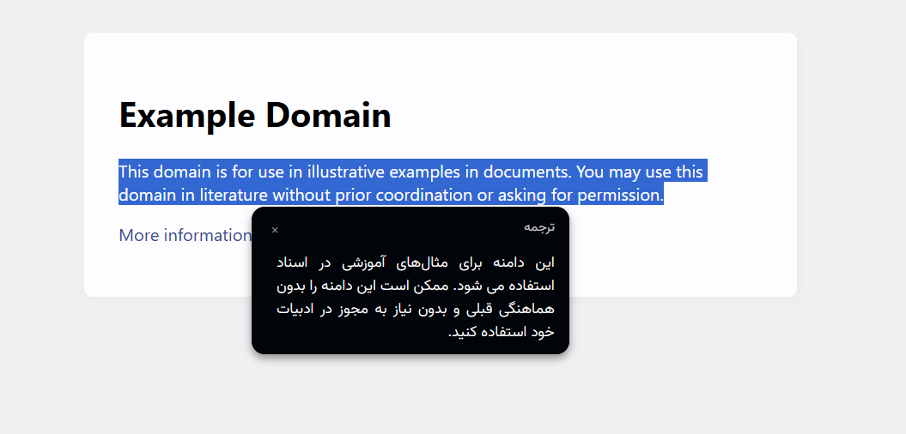

# افزونه مترجم هوش مصنوعی محلی

افزونه‌ای قدرتمند برای ترجمه متون با بهره‌گیری از مدل‌های زبانی به‌صورت کاملاً آفلاین.

## راهنمای نصب

1. از بخش [Releases](https://github.com/username/repository/releases) آخرین نسخه افزونه را دانلود کنید.
2. به بخش مدیریت افزونه‌ها در مرورگر خود بروید، حالت توسعه‌دهنده (Developer Mode) را فعال کنید، سپس فایل دانلودشده را به داخل صفحه بکشید و رها کنید تا نصب شود.

## راه‌اندازی و اتصال به سرویس‌ها

### اتصال به Ollama

1. نرم‌افزار [Ollama](https://ollama.ai) را دانلود و نصب کنید.
2. یک مدل زبانی را از Ollama دانلود و نصب کنید.
3. به تنظیمات متغیرهای محیطی سیستم (System Environment Variables) بروید و یک متغیر جدید در بخش System Variables ایجاد کنید:
   - **نام متغیر**: `OLLAMA_ORIGINS`
   - **مقدار**: `http://localhost,chrome-extension://*`
4. در تنظیمات افزونه، نام مدل دانلودشده را در بخش **Model** وارد کنید.
5. در صورت نیاز، پرامپت پیش‌فرض را تغییر دهید و از افزونه استفاده کنید.

### اتصال به LM Studio

1. نرم‌افزار [LM Studio](https://lmstudio.ai) را دانلود و نصب کنید.
2. از بخش **Models** یک مدل زبانی را دانلود و نصب کنید.
3. به بخش **Developer** بروید، مدل موردنظر را بارگذاری (Load) کنید و وضعیت آن را به **Running** تغییر دهید.
4. در تنظیمات افزونه، نام مدل بارگذاری‌شده را در بخش **Model** وارد کنید.
5. پرامپت را در صورت نیاز ویرایش کنید و از افزونه استفاده کنید.

## درباره پروژه

این پروژه یک فورک از مخزن [Translate](https://github.com/djosix/Translate) است که با بومی‌سازی محیط به زبان فارسی و اعمال بهبودهایی در عملکرد و رابط کاربری، بازنویسی شده است.